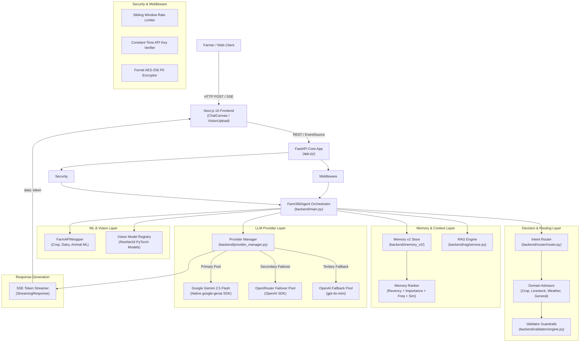
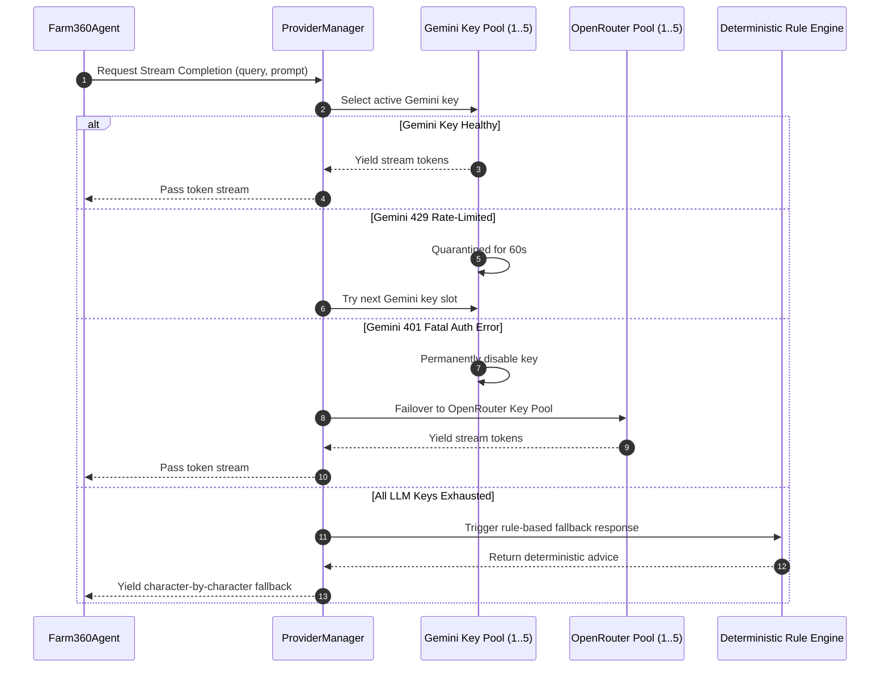
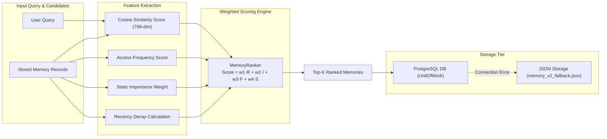
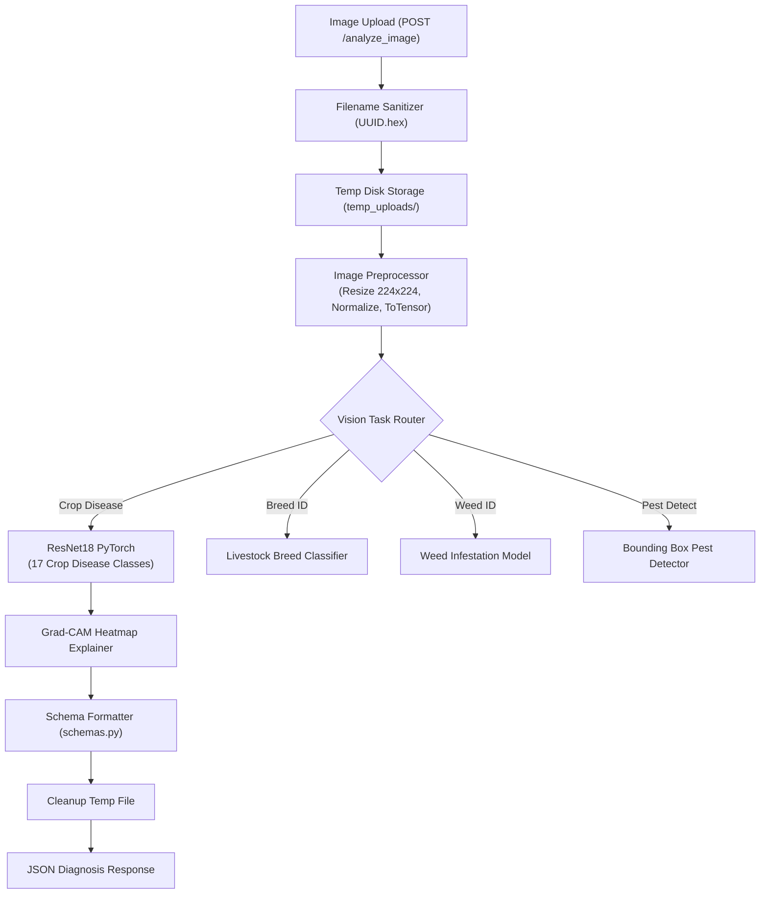

# Farm360 AI — Architecture Blueprint (`ARCHITECTURE.md`)

> **Comprehensive Technical Architecture & Component Diagrams**  
> **Version:** 3.1.0  
> **Last Updated:** 2026-07-30  

---

## 1. System Overview

Farm360 AI is architected as a micro-service inspired, modular monolith built on FastAPI and Next.js 16. The backend encapsulates machine learning inference, LLM provider orchestration, memory retrieval, RAG, and computer vision services.

---

## 2. Master System Data Flow Diagram

---

## 3. Detailed Subsystem Architectures

### 3.1 Multi-Provider Key Rotation & Failover Architecture

---

### 3.2 Memory v2 Hybrid Ranking Architecture

---

### 3.3 Multi-Task Computer Vision Pipeline

---

## 4. Architectural Principles

1. **Decoupled Business Logic:** All ML inference and vision tasks are isolated behind service interfaces.
2. **Fail-Safe Design:** Single key rate-limits or database connection failures will not crash the application.
3. **Zero Hardcoded Secrets:** All secrets load dynamically from `.env` or generate cryptographically secure temporary defaults with explicit logger warnings.
