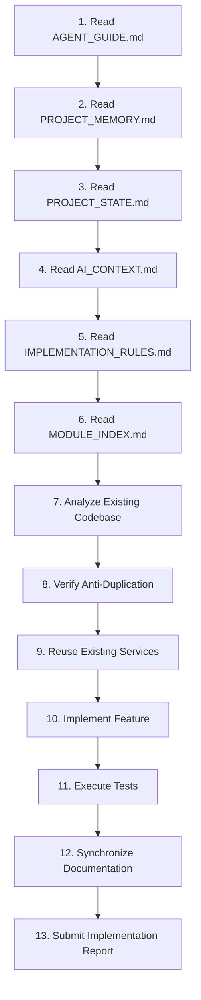

# Farm360 AI — Permanent Implementation Rules (`IMPLEMENTATION_RULES.md`)

> **Non-Negotiable Engineering Standards & Agent Workflow Rules**  
> **Version:** 3.1.0  
> **Last Updated:** 2026-07-30  

---

## 1. Permanent Engineering Rules

1. **Never Duplicate Existing Functionality:** Before implementing a new class, utility, or helper function, search the codebase (`backend/`, `machine_learning/`) to verify it does not already exist. Reuse existing services (`ProviderManager`, `MemoryStore`, `VisionRegistry`, `RAGService`, `EventBus`).
2. **Always Analyze Code Before Modifying:** Inspect the exact definition file (`backend/models/database.py`, `backend/config.py`, etc.) before making assumptions about schemas, signatures, or methods.
3. **Maintain Backward Compatibility:** Never alter public API signatures (`/chat_stream`, `/chat`, `/analyze_image`, `/vision/*`) without documenting breaking changes across `docs/`.
4. **Zero Hardcoded Secrets:** Credentials, API keys, and Fernet encryption keys must be parsed from environment variables (`.env`). Default fallbacks must generate temporary keys and log explicit warnings.
5. **Fail-Safe Fallbacks:** Systems must handle third-party provider timeouts (HTTP 429) or database connection errors gracefully without crashing the server.
6. **Symmetrical PII Encryption:** Sensitive fields in database models (`email`, `gps_coordinates`) must remain encrypted at rest via `EncryptedString`.
7. **Composition Over Inheritance:** Design modules using small, focused interface classes and pass dependencies via constructor injection.

---

## 2. Mandatory Documentation Synchronization Policy

Every future implementation or bug fix **MUST** synchronize documentation files before concluding:

- **Always Synchronize:**
  - `PROJECT_STATE.md` (update current status, readiness score, and blockers)
  - `IMPLEMENTATION_LOG.md` (add entry detailing changed files, rationale, and impact)
  - `TODO.md` (check off completed items or append new tasks)
  - `CHANGELOG.md` (log version updates and fixes)
  - `SESSION_SUMMARY.md` (update session snapshot and recommended next task)

- **Synchronize on Architecture Change:**
  - `ARCHITECTURE.md` (update Mermaid diagrams)
  - `PROJECT_MEMORY.md` (update master system architecture)
  - `DECISIONS.md` (add new Architectural Decision Record - ADR)

- **Synchronize on Module / Goal Change:**
  - `MODULE_INDEX.md` (if a new module or service was added)
  - `MASTER_ROADMAP.md` (if milestone progress changed)
  - `AI_CONTEXT.md` (if business or engineering philosophy changed)

---

## 3. Mandatory 13-Step Agent Workflow

Future coding agents and engineers must execute the following 13 steps for every development task:

### Required Implementation Report Structure
At the conclusion of an implementation, the agent must output a report formatted as follows:
- **Summary of Work Completed**
- **Files Created**
- **Files Modified**
- **Tests Executed & Validation Results**
- **Risks Identified & Mitigation**
- **Performance & Security Impact**
- **Documentation Updated**
- **Recommended Next Task**
