# Farm360 AI — Feature Traceability Matrix (`TRACEABILITY_MATRIX.md`)

> **Version:** 3.1.0  
> **Generated Date:** 2026-07-30  
> **Last Updated:** 2026-07-30  
> **Repository Commit:** cf67062  
> **Generator:** Antigravity AI Architecture Engine  
> **Status:** Active / Synchronized  

---

## 1. Executive Traceability Summary

The **Traceability Matrix** maps every high-level business feature in **Farm360 AI** through its end-to-end implementation chain: API endpoint, backend service class, database model, machine learning model, frontend component, test suite, and documentation specification.

---

## 2. Complete End-to-End Traceability Table

| Feature Name | REST Endpoint | Backend Service Class | Database Model | ML Model Weight | Frontend Component | Test File | Documentation File |
|---|---|---|---|---|---|---|---|
| **Crop Disease Diagnosis** | `POST /vision/crop-disease` `POST /analyze_image` | `VisionEngine` `Farm360Agent` | `Prediction` | `crop_disease_model.pth` (PyTorch ResNet18) | `VisionUpload.tsx` `ChatCanvas.tsx` | `test_vision.py` | `PROJECT_MEMORY.md` `MODULE_INDEX.md` |
| **Real-Time SSE Chat Streaming** | `POST /chat_stream` | `StreamManager` `ProviderManager` | `ConversationHistory` `ChatSession` | N/A (Gemini 2.5 Flash / Gemma) | `ChatCanvas.tsx` `ChatInput.tsx` | `test_stream.py` | `ARCHITECTURE.md` `PROJECT_MEMORY.md` |
| **Multi-Provider Failover & Rotation** | `GET /keys/status` `GET /api/health/providers` | `ProviderManager` | N/A | N/A | `Sidebar.tsx` | `test_llm.py` `test_gemini_native.py` | `DECISIONS.md` `MODULE_INDEX.md` |
| **Crop Yield Forecasting** | `POST /chat` | `FarmAPIWrapper` `DecisionEngine` | `Prediction` `Crop` | `production_model_log.pkl` (scikit-learn) | `ChatCanvas.tsx` | `test_local_server.py` | `PROJECT_MEMORY.md` `MODULE_INDEX.md` |
| **Dairy Production Forecasting** | `POST /chat` | `FarmAPIWrapper` | `MilkCollection` `Animal` | `dairy_intelligence_v1.pkl` (scikit-learn) | `ChatCanvas.tsx` | `test_local_server.py` | `PROJECT_MEMORY.md` `MODULE_INDEX.md` |
| **Animal Disease Diagnosis** | `POST /chat` | `FarmAPIWrapper` | `Prediction` `Animal` | `animal_disease_model.pkl` | `ChatCanvas.tsx` | `test_local_server.py` | `PROJECT_MEMORY.md` `MODULE_INDEX.md` |
| **Memory v2 Context Retrieval** | Internal Service | `MemoryStore` `MemoryRanker` | `MemoryRecord` `MemorySummary` | 768-dim Gemini Embedder | `ChatCanvas.tsx` | `tests/test_memory_v2.py` | `ARCHITECTURE.md` `MODULE_INDEX.md` |
| **RAG Knowledge Ingestion** | Internal Service | `RAGService` `Retriever` | `Document` `DocumentChunk` | 768-dim Gemini Embedder | N/A | `tests/test_rag.py` | `PROJECT_MEMORY.md` `MODULE_INDEX.md` |
| **Encrypted User Profile** | Internal Service | `SecurityService` | `User` `UserProfile` | N/A | N/A | `tests/test_security.py` | `PROJECT_MEMORY.md` `DECISIONS.md` |

---

## 3. Visual Feature Traceability Diagrams

### 3.1 Multi-Task Crop Vision Flow

```mermaid
flowchart LR
    User["Farmer"] --> VisionUpload["VisionUpload.tsx"]
    VisionUpload --> REST["POST /vision/crop-disease"]
    REST --> Sanitize["sanitize_filename()"]
    Sanitize --> Engine["VisionEngine (engine.py)"]
    Engine --> PyTorch["ResNet18 (crop_disease_model.pth)"]
    PyTorch --> GradCAM["GradCAMExplainer"]
    GradCAM --> DB["Prediction Model (database.py)"]
    DB --> JSON["JSON Diagnosis Response"]
    JSON --> ChatCanvas["ChatCanvas.tsx"]
```

---

### 3.2 Real-Time SSE Token Streaming Flow

```mermaid
flowchart LR
    User["Farmer Query"] --> ChatInput["ChatInput.tsx"]
    ChatInput --> SSEEndpoint["POST /chat_stream"]
    SSEEndpoint --> RateLimit["rate_limit_middleware"]
    RateLimit --> Agent["Farm360Agent"]
    Agent --> ProviderManager["ProviderManager"]
    ProviderManager --> GeminiSDK["google-genai SDK"]
    GeminiSDK --> TokenYield["Token Stream Producer"]
    TokenYield --> SSEStream["StreamingResponse (data: token)"]
    SSEStream --> ChatCanvas["ChatCanvas.tsx (Text Renderer)"]
```

